# OPNsense VM Setup in Proxmox

## Objective
This lab simulates deploying a virtual firewall/router in a homelab environment by creating and installing an OPNsense virtual machine in Proxmox.

**Topology (high-level):**
Proxmox → vmbr1 (WAN to ISP/router)  
Proxmox → vmbr0 (LAN to internal network)

## ISO Upload

The OPNsense ISO was uploaded to Proxmox storage and verified.

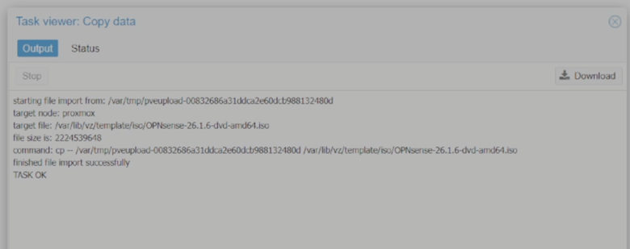

## Virtual Machine Creation

### General
- VM Name: OPNsense
- Guest OS Type: Other

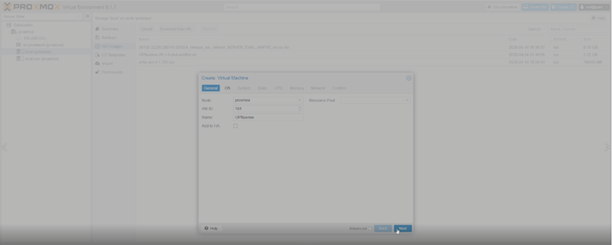

### System
- BIOS: OVMF (UEFI)
- Machine Type: q35
- EFI Disk enabled

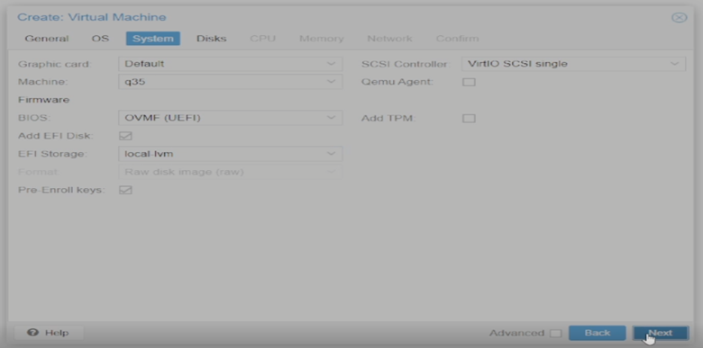

### Disks
- Storage: local-lvm
- Disk size: 32GB
- Bus/Device: VirtIO

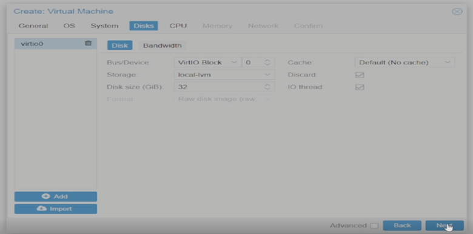

### CPU
- 2 cores assigned

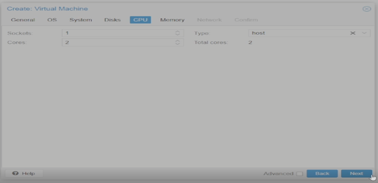

### Memory
- 4GB RAM allocated

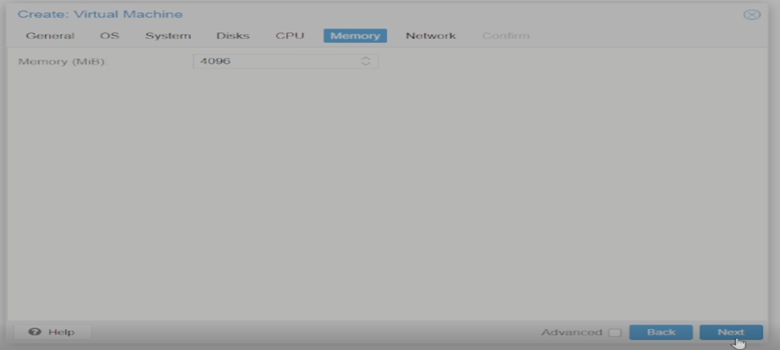

### Network
- Adapter Model: VirtIO (paravirtualized)
- Interfaces:
  - net0 → vmbr0 (LAN)
  - net1 → vmbr1 (WAN)

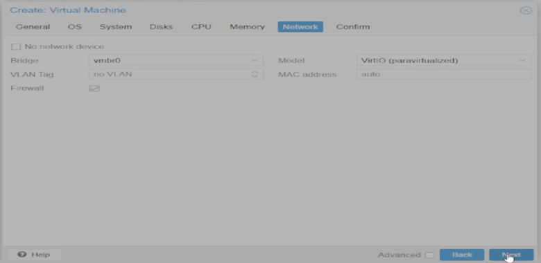

## Boot Issues & Fix

Initial boot failed due to incorrect boot order.

### Before

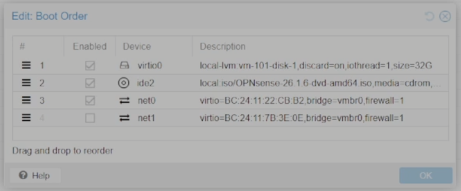

### After

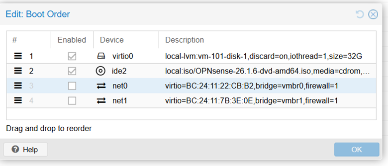

### WAN Interface Verification

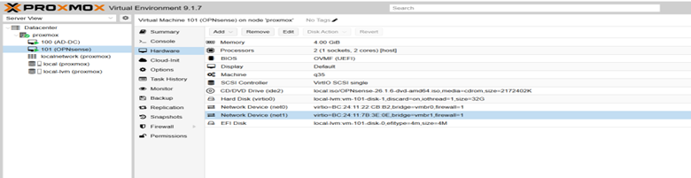

### Fix:
- Moved CD-ROM (ISO) above disk to start the installer
- Verified disk and NIC order before reboot

## OPNsense Installation Process
This section documents the full installation workflow of OPNsense within a Proxmox virtual machine.

Installation steps:

- Selected default keymap
- Chose guided installation
- Selected target disk (32GB virtual disk)
- Confirmed partitioning
- Set root password
- Completed installation and rebooted

### Installation Screens

#### Keymap

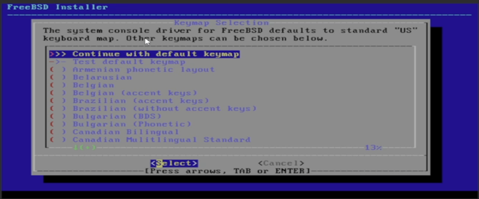

#### Installer Menu

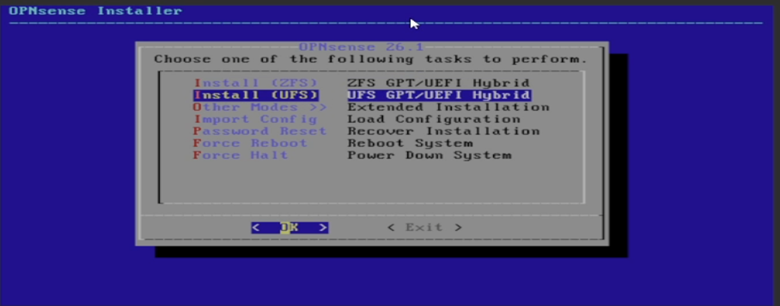

#### Disk Selection

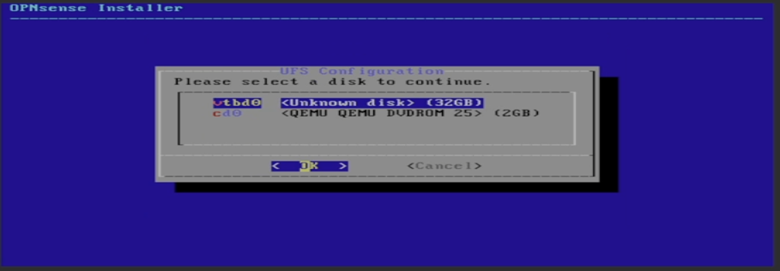

#### Swap

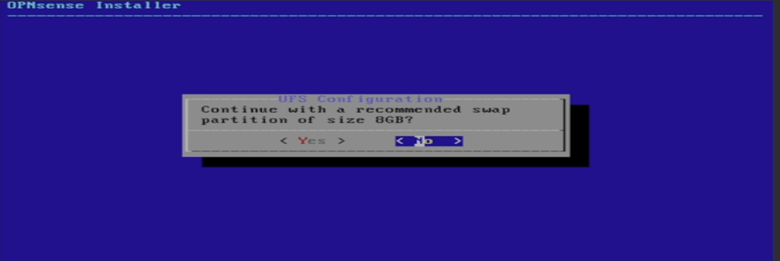

#### Confirm Disk

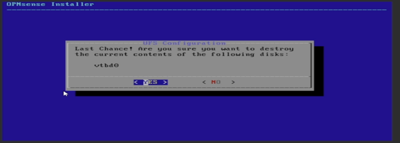

#### Install Progress

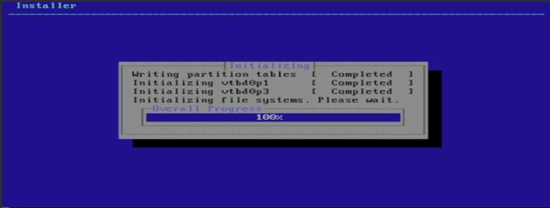

#### Set Password

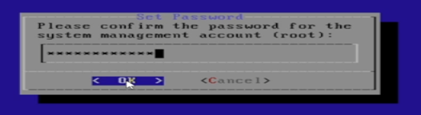

#### Install Complete

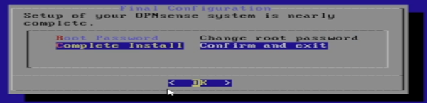

#### Reboot

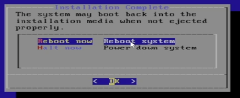

## Post-Install Console Output
Access the web UI at https://192.168.1.1 (self-signed certificate).

Validated connectivity from LAN (ping 8.8.8.8 and DNS resolution) after WAN obtained a DHCP lease.

After installation, OPNsense displayed:

- LAN interface: 192.168.1.1/24
- WAN interface: DHCP assigned (10.0.0.x)

The system successfully booted into the OPNsense environment.

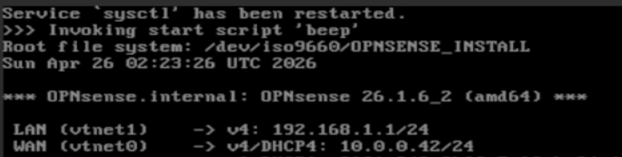

## Key Takeaways

- Confirmed internet access from LAN after install (via WAN DHCP)
- VirtIO was used for better performance in Proxmox
- Separate WAN bridge (vmbr1) was created later for proper network separation
- Identified and resolved a boot order misconfiguration during VM deployment
- Verified WAN connectivity via DHCP assignment after initial boot

## Next Step

Proceed to initial OPNsense configuration (next phase of the lab):
- Interface assignment
- WAN/LAN setup
- Connectivity testing

## Follow-up
See: [OPNsense Initial Configuration](screenshots/../opnsense-initial-configuration/README.md)
