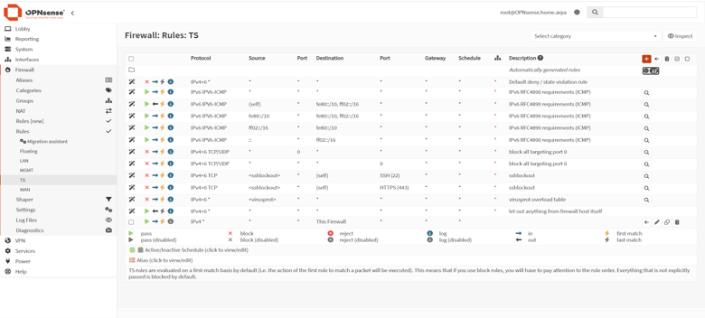
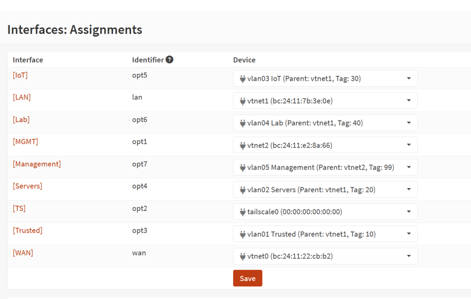
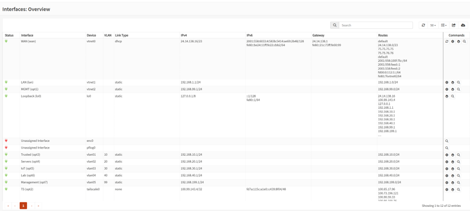
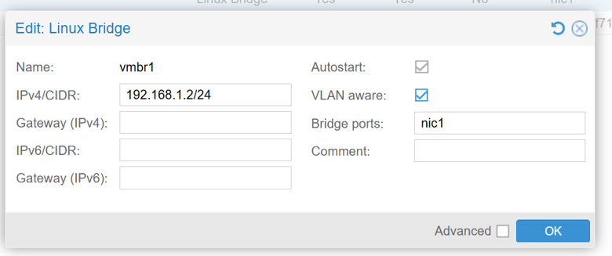
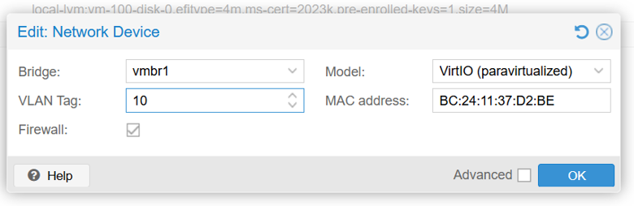
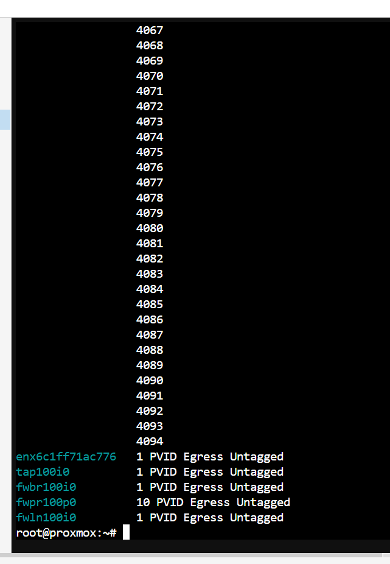
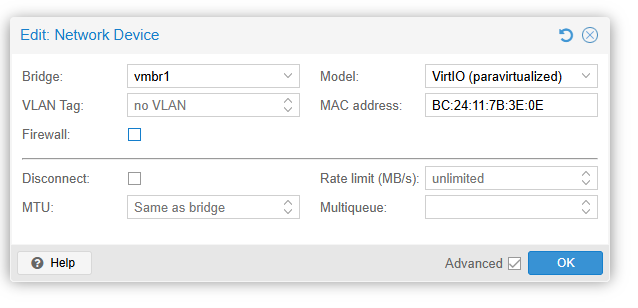
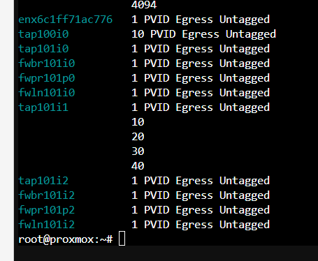
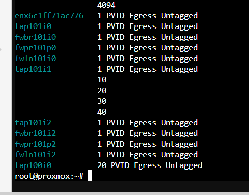
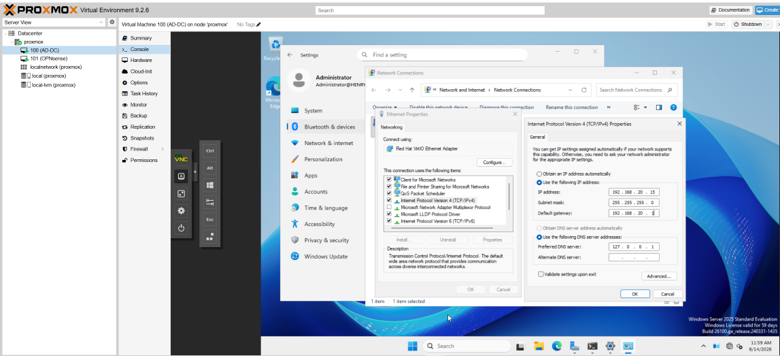

# Phase 5 — VLAN Trunking: Getting VMs onto Tagged VLANs (Proxmox + OPNsense)

**Goal:** Place the Active Directory Domain Controller onto a dedicated, properly-segmented VLAN, delivered end-to-end from OPNsense through a VLAN-aware Proxmox bridge — with no physical switch trunk required, since both the DC and OPNsense run as VMs on the same host.

**Outcome:** DC (henry.local) now lives on the Servers VLAN (20) at **192.168.20.15**, with working gateway, internet routing, and DNS. The full tagged-VLAN path from VM → VLAN-aware bridge → OPNsense trunk → firewall → WAN is verified.

> **Note on the .15 address:** This lab originally ran two domain controllers. During consolidation to the single `henry.local` DC, the old DC was retired and its IP freed up. The surviving DC was moved to **192.168.20.15** to avoid a conflict with stale state from the retired DC, so the final placement is `.15` rather than the `.10` used earlier in testing.

## Starting Point / Environment

| Component | Details |
|---|---|
| Hypervisor | Proxmox VE 9.2.6, single node `proxmox` (192.168.1.2) |
| Router/Firewall | OPNsense as VM 101, 3 vNICs (WAN/LAN/MGMT) |
| Domain Controller | Windows Server 2025 as VM 100, domain `henry.local` |
| Bridges | vmbr0 = WAN, vmbr1 = LAN/trunk (192.168.1.2/24), vmbr2 = MGMT (192.168.99.2/24) |
| Out-of-band access | Proxmox VM console (noVNC), Tailscale, MGMT VLAN |

**VLANs (defined in OPNsense, all on parent vtnet1):**

| VLAN | Name | Subnet | Gateway | DHCP pool (Kea) |
|---|---|---|---|---|
| 10 | Trusted | 192.168.10.0/24 | 192.168.10.1 | .100–.200 |
| 20 | Servers | 192.168.20.0/24 | 192.168.20.1 | .100–.200 |
| 30 | IoT | 192.168.30.0/24 | 192.168.30.1 | .100–.200 |
| 40 | Lab | 192.168.40.0/24 | 192.168.40.1 | .100–.200 |
| 99 | MGMT | 192.168.99.0/24 | 192.168.99.1 | (excluded) |





**Key discovery at the start:** These VLANs were configured in OPNsense (interfaces up, IPs assigned, DHCP scopes created) but had never actually carried traffic. No device had ever been placed on them, and no trunk (virtual or physical) had ever been built to carry the tagged VLANs to any endpoint. This session was the first real traffic on the VLAN path — which is why several "should already work" assumptions turned out to be untrue.

## The Core Concept (the lesson that anchors everything)

An IP address is only a label. **VLAN membership is decided by the bridge/switch port an interface is connected to — not by the IP you type into the OS.**

Assigning a VM 192.168.20.15 does not put it on VLAN 20. The VM's virtual NIC must be tagged for VLAN 20 on a VLAN-aware bridge, and that bridge must trunk the tag to OPNsense, where the VLAN 20 interface lives. If any link in that chain doesn't carry the tag, the traffic silently dies.

## Problems Hit & How They Were Solved

The troubleshooting followed a clean layer-by-layer isolation. Each symptom change pointed to the next layer.

### Problem 1 — DC had a VLAN IP but couldn't reach its gateway
**Symptom:** DC set to 192.168.10.22, gateway 192.168.10.1, but `ping 192.168.10.1` returned "Destination host unreachable from .22".
**Diagnosis:** "Unreachable from itself" = the VM couldn't even build a Layer-2 path. The IP was correct but the VM's NIC was on the untagged flat LAN, not VLAN 10.
**Root cause:** The Proxmox bridge (vmbr1) was not VLAN-aware, and the VM's NIC had no VLAN tag.

### Problem 2 — Making the bridge VLAN-aware + tagging the VM
**Fix:** Enabled VLAN aware on vmbr1 (adds `bridge-vlan-aware yes`, `bridge-vids 2-4094`) and applied live with `ifreload -a`. Tagged the VM's NIC: VM 100 → Hardware → Network Device → VLAN Tag = 10. Verified live bridge state:
```bash
cat /sys/class/net/vmbr1/bridge/vlan_filtering   # → 1 (VLAN-aware active)
qm config 100 | grep net                         # → ...,bridge=vmbr1,tag=10
```



Still failed — symptom persisted. On to the next layer.

### Problem 3 — The Proxmox per-VM firewall wrapper breaks VLAN tagging ⚠️

This was the subtle one.

**Symptom:** `bridge vlan show` revealed the VM's traffic goes through a firewall bridge chain (because `firewall=1` on the NIC):
```
tap100i0    1  PVID Egress Untagged   ← VM side, untagged VLAN 1
fwbr100i0   1  PVID Egress Untagged   ← firewall bridge, NOT VLAN-aware
fwpr100p0   10 PVID Egress Untagged   ← tag applied only at the vmbr1 edge
fwln100i0   1  PVID Egress Untagged
```


**Root cause:** Enabling the per-VM firewall inserts an intermediate bridge chain (fwbr/fwln/fwpr). The VLAN tag was applied only at the outer edge (fwpr100p0), but the inner firewall bridge (fwbr100i0) is not VLAN-aware and forwards everything as untagged VLAN 1 — breaking tag continuity.

**Interface naming reference:**

| Interface | Meaning |
|---|---|
| tap100i0 | The VM's virtual NIC (tap). 100 = VM ID, i0 = net0 |
| fwbr100i0 | firewall bridge — per-VM bridge for iptables rules |
| fwln100i0 | firewall link — veth leg toward the VM/tap side |
| fwpr100p0 | firewall pair — veth leg plugged into the real bridge |

**Fix:** Disabled the per-VM firewall on the DC's NIC (OPNsense is the real firewall anyway). This removes the entire fwbr chain so the tap plugs straight into vmbr1:
```bash
# Hardware → Network Device → untick "Firewall", then full Shutdown/Start
bridge vlan show   # → tap100i0 now shows "10 PVID", fw* chain gone
```
**Result:** From the Proxmox host, `ping 192.168.10.1` now succeeded (0% loss) — proving the VLAN path from host → OPNsense was good. But from inside the DC it still failed. Next layer.

### Problem 4 — The trunk to OPNsense was never actually carrying the VLANs ⚠️
**Symptom:** Host could reach .10.1, but the DC could not — its tagged-10 ARP for the gateway got no reply.
**Diagnosis:** `bridge vlan show` showed OPNsense's port on vmbr1 was only a member of VLAN 1 — none of the tagged VLANs (10/20/30/40) were allowed to it:
```
tap101i1  1 PVID Egress Untagged   ← OPNsense LAN/trunk NIC, VLAN 1 only!
```
**Root cause — the crux of the whole session:** Before vmbr1 was made VLAN-aware, it was a "dumb" bridge that passed all 802.1Q frames transparently, so OPNsense's tagged sub-interfaces worked. The moment the bridge became VLAN-aware, it started filtering — and OPNsense's port was only a VLAN 1 member, so the bridge now dropped the tagged 10–40 frames. Making the bridge VLAN-aware to fix the DC had simultaneously broken the (implicit) trunk to OPNsense.

**Fix — build a proper trunk on OPNsense's LAN NIC.** OPNsense's net1 needs to be a trunk carrying VLAN 1 as native/untagged plus VLANs 10/20/30/40 tagged.

Safety first (this reconfigures the live router's LAN port):
- Verified out-of-band access: Proxmox VM console + Tailscale + MGMT VLAN.
- Took a Proxmox snapshot pre-trunk of VM 101 for one-click rollback.

Then, from the Proxmox host shell:
```bash
# (firewall already disabled on net1 via GUI, same fwbr reason as the DC — see below)
qm set 101 -net1 'virtio=BC:24:11:7B:3E:0E,bridge=vmbr1,trunks=10;20;30;40'
qm config 101 | grep net1
# → net1: virtio=...,bridge=vmbr1,trunks=10;20;30;40
```
Note: the `;` in `trunks=` must be quoted in bash or it's parsed as a command separator.

A full Shutdown → Start of VM 101 applied it (brief router downtime; covered by the out-of-band paths). Verified:
```
tap101i1  1 PVID Egress Untagged  10 20 30 40   ← native VLAN 1 + tagged 10/20/30/40 ✅
```


**Result:** symptom changed from "unreachable" to "request timed out" — a diagnostic breadcrumb meaning the tagged frame now reached OPNsense but got no reply. That's a firewall drop, not a wiring problem. Last layer.

### Problem 5 — New OPNsense VLAN interfaces have no firewall rules
**Symptom:** `ping 192.168.10.1` → "Request timed out" (packet arrives, silently dropped).
**Root cause:** A freshly-created OPNsense interface is default-deny with no rules. The Trusted interface had zero pass rules, so all inbound traffic — including ICMP to its own gateway — was dropped.
**Fix:** Added a pass rule on the interface: Firewall → Rules → Trusted → Add, Action: Pass | Protocol: any | Source: Trusted net | Destination: any → Save → Apply.
**Result:** `ping 192.168.10.1` replied from the gateway (TTL 64), 0% loss. ✅

## 4. Verification (all passing)

From inside the DC:
```
ping 192.168.10.1   → Reply from 192.168.10.1, TTL=64, 0% loss  (gateway)
ping 8.8.8.8        → Reply, TTL=117, 0% loss                    (internet/WAN)
nslookup google.com → resolved via localhost                     (DNS)
```
Cleared stale state from the IP/VLAN churn:
```
ipconfig /registerdns
Restart-Service netlogon
```

## 5. Moving the DC to the Servers VLAN (final placement)

**Design decision:** Domain controllers / infrastructure belong on a dedicated Servers VLAN, isolated from user workstations on Trusted. This models real enterprise segmentation, so the DC was moved from Trusted (10) to Servers (20).

Because the trunk + VLAN-aware bridge were already built, this required only retagging + a new IP — no infrastructure changes:
- VM 100 → Hardware → Network Device → VLAN Tag = 20
- Inside Windows: static IP **192.168.20.15/24**, gw 192.168.20.1, DNS 127.0.0.1 (.15 is below the Kea DHCP pool of .100–.200, so no conflict)
- Full Shutdown → Start (tag applies on NIC re-attach)
- Temporary "allow any" pass rule on the Servers interface for testing
- Verified: `bridge vlan show` → tap100i0 = 20 PVID; gateway + internet OK




> During consolidation the older, second DC was retired; the surviving `henry.local` DC was placed at **192.168.20.15** to sidestep leftover state from the decommissioned DC.

## 6. Final Architecture
```
┌──────────────── Proxmox host (single node) ────────────────┐
│                                                            │
│ Internet ── WAN ──► vmbr0 ──► OPNsense (VM 101)            │
│                                  │                         │
│                                  │ net1 = TRUNK:           │
│                                  │ native VLAN 1 +         │
│                                  │ tagged 10/20/30/40      │
│                                  ▼                         │
│                     vmbr1 (VLAN-aware bridge,             │
│                            bridge-vids 2-4094)            │
│                                  │                         │
│                                  ▼                         │
│         tap100i0 (tag=20) ──► DC / VM 100 (192.168.20.15) │
│         [firewall wrapper disabled → clean tag]           │
└────────────────────────────────────────────────────────────┘
```
**VLAN interfaces (in OPNsense, parent vtnet1 = net1):**
- Trusted 10 → 192.168.10.1
- Servers 20 → 192.168.20.1
- IoT 30 → 192.168.30.1
- Lab 40 → 192.168.40.1

## 7. Key Takeaways
- **VLAN membership = the port/bridge, not the OS IP.** Typing a subnet's IP does nothing without the tag on a VLAN-aware bridge.
- **VLAN-aware bridges filter; dumb bridges pass everything.** Enabling VLAN-awareness to tag one VM can break a previously-working transparent trunk to your router. Every port must be an explicit member of the VLANs it should carry.
- **The Proxmox per-VM firewall (fwbr wrapper) breaks VLAN tagging.** For tagged VMs, disable the NIC-level firewall and let the upstream firewall (OPNsense) enforce policy.
- **New OPNsense interfaces are default-deny with no rules** — they silently drop all traffic until a pass rule is added.
- **Read the error message transitions as diagnostics:** unreachable (L2 broken) → timed out (reached, but dropped by firewall) → reply (working). Each transition confirms you fixed one layer.
- **Trunk config lives on the OPNsense VM's NIC** via `qm set -netN '...,trunks=10;20;30;40'` (quote the semicolons).
- **Always snapshot + confirm out-of-band access** before reconfiguring a live router's LAN port.

## 8. Still To Do (next sessions)
- Replace the temporary "allow any" on Servers with least-privilege rules (inbound only DNS/Kerberos/LDAP/LDAPS/SMB/RDP from Trusted; deny IoT/Lab).
- Build IoT (30) "jail": internet-only, blocked from all internal VLANs.
- Build Lab (40) isolation: walled off from Servers/Trusted; DNS-only to the DC if needed.
- Default-deny inter-VLAN, allow only explicit exceptions; verify by testing blocked pings across VLANs (great screenshots for the repo).
- Build the physical switch trunk (SODOLA → Proxmox host) + access ports per VLAN, and the EAP650 trunk for multi-SSID→VLAN WiFi — to extend VLANs to physical devices.
- Re-enable per-VM firewalls only where they won't interfere with tagging.
- ~~Retire the VirtualBox DC01 (adlab.local) to consolidate to the single henry.local domain.~~ **Done — old DC retired, surviving DC moved to 192.168.20.15.**
- Delete the pre-trunk snapshot on VM 101 once fully confirmed stable.
